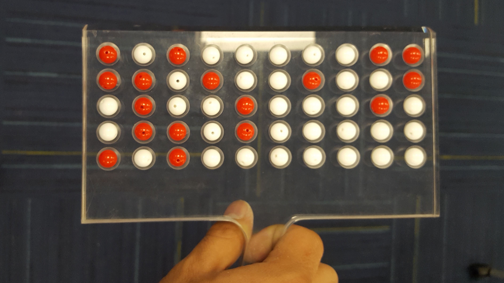

```{r setup, include=FALSE}
knitr::opts_chunk$set(echo = TRUE, comment = NA, fig.align = "center", warning = FALSE, message = FALSE)
library(dplyr)
library(ggplot2)
library(moderndive)
library(knitr)
library(cowplot)
```


> Note: In this chapter we learn sampling distributions. 

> 1. First we will look at a simple activity like example.
    
> 2. We will have sections named "DETOUR #", we will learn some brand name distributions in these sections.
    
Let's begin...

# Sampling Distribution of the sample proportion

## What proportion of this bowl’s balls are red?

Take a look at the bowl in the following Figure. It has a certain number of red and a certain number of white balls all of equal size. Furthermore, it appears the bowl has been mixed beforehand as there does not seem to be any particular pattern to the spatial distribution of red and white balls.


Let’s now ask ourselves, what proportion of this bowl’s balls are red?


One way to answer this question would be to perform an exhaustive count: remove each ball individually, count the number of red balls and the number of white balls, and divide the number of red balls by the total number of balls. **However this would be a long and tedious process.**





Observe that ____ of the balls are red and there are a total of ____ balls and thus ___ % of the shovel’s balls are red. We can view the proportion of balls that are red in this shovel as a guess of the proportion of balls that are red in the entire bowl. While not as exact as doing an exhaustive count, our guess of ___% took much less time and energy to obtain.


However, say, we started this activity over from the beginning. In other words, we replace the 50 balls back into the bowl and start over. Would we remove exactly 17 red balls again? In other words, would our guess at the proportion of the bowl’s balls that are red be exactly 34% again? Maybe?

What if we repeated this exercise several times? Would I obtain exactly 17 red balls each time? In other words, would our guess at the proportion of the bowl’s balls that are red be exactly 34% every time? Surely not. 


Let’s try do this on the computer...

To this end, we use a data frame `bowl` in the `moderndive` package whose rows correspond exactly with the contents of the actual bowl.

```{r}
head(bowl)
# View(bowl) # Use this in the console
```

Observe in the output that bowl has ___ rows, telling us that the bowl contains ___ equally-sized balls. The first variable `ball_ID` is used merely as an “identification variable”, none of the balls in the actual bowl are marked with numbers. The second variable `color` indicates whether a particular virtual ball is red or white. 

Now that we have a virtual analogue of our bowl, we now need a virtual analogue for the shovel seen in Figure 2; we’ll use this virtual shovel to generate our virtual random samples of 50 balls. We’re going to use the `rep_sample_n()` function included in the `moderndive` package. This function allows us to take repeated, or replicated, samples of size n. Run the following and explore.


```{r}
virtual_shovel <- bowl %>% 
  rep_sample_n(size = 50)

virtual_shovel
```

Next we can find out how many res ones are there in our `virtual_shovel`

```{r}
virtual_shovel %>% 
  summarize(num_red = sum(color=="red"))  
```

How about the proportion on red? We can use the `mutate` (new) function to create a new variable, in this case `prop_red`.


```{r}
virtual_shovel %>% 
  summarize(num_red = sum(color == "red")) %>% 
  mutate(prop_red = num_red / 50)

```

## Using the virtual shovel many times

```{r}
virtual_samples <- bowl %>% 
  rep_sample_n(size = 50, reps = 30)

#kable(virtual_samples)
```


Observe that while the first 50 rows of replicate are equal to 1, the next 50 rows of replicate are equal to 2. This is telling us that the first 50 rows correspond to the first sample of 50 balls while the next 50 correspond to the second sample of 50 balls. This pattern continues for all reps = 30 replicates and thus `virtual_samples` has $30 \times 50 = 1500$ rows.

```{r}
virtual_prop_red <- virtual_samples %>% 
  group_by(replicate) %>% 
  summarize(red = sum(color == "red")) %>% 
  mutate(prop_red = red / 50)

virtual_prop_red
#kable(virtual_prop_red) # To see all 30 samples
```


Let’s visualize the distribution of these 33 proportions red based on 33 virtual samples using a histogram with `binwidth = 0.05`

```{r}
ggplot(virtual_prop_red, aes(x = prop_red)) +
  geom_histogram(binwidth = 0.05, boundary = 0.4, color = "white", fill = "steelblue") +
  labs(x = "Proportion of 50 balls that were red", 
       title = "Distribution of 30 proportions red") 
```


Observe that occasionally we obtained proportions red that are less than ____, while on the other hand we occasionally we obtained proportions that are greater than ____. However, the most frequently occurring proportions red out of 50 balls were between ____ % and ____ % (for ___ out 30 samples). Why do we have these differences in proportions red? Because of ___________________.


```{exercise}

Redo the above activity with 1000 repeated samples and state your conclusions.

```


### Using different shovels


If your goal was still to estimate the proportion of the bowl’s balls that were red, which shovel would you choose? Why? Let's try to answer these questions.


```{r}
# Segment 1: sample size = 25 ------------------------------
# 1.a) Virtually use shovel 1000 times
virtual_samples_25 <- bowl %>% 
  rep_sample_n(size = 25, reps = 1000)

# 1.b) Compute resulting 1000 replicates of proportion red
virtual_prop_red_25 <- virtual_samples_25 %>% 
  group_by(replicate) %>% 
  summarize(red = sum(color == "red")) %>% 
  mutate(prop_red = red / 25)

# 1.c) Plot distribution via a histogram
p1 <- ggplot(virtual_prop_red_25, aes(x = prop_red)) +
  geom_histogram(binwidth = 0.05, boundary = 0.4, color = "white") +
  labs(x = "Pro of 25 balls that were red", title = "25") 

# Segment 2: sample size = 50 ------------------------------
# 2.a) Virtually use shovel 1000 times
virtual_samples_50 <- bowl %>% 
  rep_sample_n(size = 50, reps = 1000)

# 2.b) Compute resulting 1000 replicates of proportion red
virtual_prop_red_50 <- virtual_samples_50 %>% 
  group_by(replicate) %>% 
  summarize(red = sum(color == "red")) %>% 
  mutate(prop_red = red / 50)

# 2.c) Plot distribution via a histogram
p2 <- ggplot(virtual_prop_red_50, aes(x = prop_red)) +
  geom_histogram(binwidth = 0.05, boundary = 0.4, color = "white") +
  labs(x = "Pro of 50 balls that were red", title = "50")  

# Segment 3: sample size = 100 ------------------------------
# 3.a) Virtually using shovel with 100 slots 1000 times
virtual_samples_100 <- bowl %>% 
  rep_sample_n(size = 100, reps = 1000)

# 3.b) Compute resulting 1000 replicates of proportion red
virtual_prop_red_100 <- virtual_samples_100 %>% 
  group_by(replicate) %>% 
  summarize(red = sum(color == "red")) %>% 
  mutate(prop_red = red / 100)

# 3.c) Plot distribution via a histogram
p3 <- ggplot(virtual_prop_red_100, aes(x = prop_red)) +
  geom_histogram(binwidth = 0.05, boundary = 0.4, color = "white") +
  labs(x = "Pro of 100 balls that were red", title = "100") 


plot_grid(p1, p2, p3, nrow = 1)

```


Observe that as the sample size increases, the ______ of the 1000 replicates of the proportion red decreases. In other words, as the sample size increases, there are less differences due to sampling variation and the distribution centers more tightly around the same value. Eyeballing the above Figure, things appear to center tightly around roughly ____%.

```{r}
# n = 25
virtual_prop_red_25 %>% 
  summarize(sd = sd(prop_red))

# n = 50
virtual_prop_red_50 %>% 
  summarize(sd = sd(prop_red))

# n = 100
virtual_prop_red_100 %>% 
  summarize(sd = sd(prop_red))


```

|Number of slots in shovel |	Standard deviation of proportions red |
|------------ | --------------
| 25 |	0.0978 |
| 50 |	0.0669 |
| 100	| 0.0471 |


**As the sample size increases our numerical measure of spread decreases; there is less variation in our proportions red. In other words, as the sample size increases, our guesses at the true proportion of the bowl’s balls that are red get more consistent and precise.**


## What did we learn?


This was our first attempt at understanding two key concepts relating to sampling for estimation:

  1. The effect of sampling variation on our estimates.
  2. The effect of sample size on sampling variation.
  
Let’s now introduce some terminology and notation as well as statistical definitions related to sampling. 


## Terminology & notation

  1. **(Study) Population**: A (study) population is a collection of individuals or observations about which we are interested. We mathematically denote the population’s size using upper case N. In our simulations the (study) population was the collection of  N = 2400 identically sized red and white balls contained in the bowl.
  
  2. **Population parameter**: A population parameter is a numerical summary quantity about the population that is unknown, but you wish you knew. For example, when this quantity is a mean, the population parameter of interest is the population mean which is mathematically denoted with the Greek letter $\mu$ (pronounced “mu”). In our simulations however since we were interested in the proportion of the bowl’s balls that were red, the population parameter is the population proportion which is mathematically denoted with the letter $p$.
  
  3. **Census**: An exhaustive enumeration or counting of all $N$ individuals or observations in the population in order to compute the population parameter’s value exactly. In our simulations, this would correspond to manually going over all $N = 2400$ balls in the bowl and counting the number that are red and computing the population proportion $p$ of the balls that are red exactly. When the number $N$ of individuals or observations in our population is large, as was the case with our bowl, a census can be very expensive in terms of time, energy, and money.
  
  4. **Sampling**: Sampling is the act of collecting a sample from the population when we don’t have the means to perform a census. We mathematically denote the sample’s size using lower case $n$, as opposed to upper case $N$ which denotes the population’s size. Typically the sample size $n$ is much smaller than the population size  $N$, thereby making sampling a much cheaper procedure than a census. In our simulations, we used shovels with 25, 50, and 100 slots to extract a sample of size  $n = 25$,  $n = 50$, and $n = 100$ balls.
  
  5. **Point estimate (AKA sample statistic)**: A summary statistic computed from the sample that estimates the unknown population parameter. In our simulations, recall that the unknown population parameter was the population proportion and that this is mathematically denoted with p. Our point estimate is the sample proportion: the proportion of the shovel’s balls that are red. In other words, it is our guess of the proportion of the bowl’s balls balls that are red. We mathematically denote the sample proportion using $\hat{p}$; the “hat” on top of the p indicates that it is an estimate of the unknown population proportion $p$.
  
  6. **Representative sampling**: A sample is said be a representative sample if it is representative of the population. In other words, are the sample’s characteristics a good representation of the population’s characteristics? In our simulations, are the samples of $n$ balls extracted using our shovels representative of the bowl’s $N = 2400$ balls?
  
  7. **Generalizability**: We say a sample is generalizable if any results based on the sample can generalize to the population. In other words, can the value of the point estimate be generalized to estimate the value of the population parameter well? In our simulations, can we generalize the values of the sample proportions red of our shovels to the population proportion red of the bowl? Using mathematical notation, is $\hat{p}$ a “good guess” of $p$?
  
  8. **Bias**: In a statistical sense, we say bias occurs if certain individuals or observations in a population have a higher chance of being included in a sample than others. We say a sampling procedure is unbiased if every observation in a population had an equal chance of being sampled. In our simulations, since each ball had the same size and hence an equal chance of being sample in our shovels, our samples were unbiased.
  
  9. **Random sampling**: We say a sampling procedure is random if we sample randomly from the population in an unbiased fashion. In our simulations, this would correspond to sufficiently mixing the bowl before each use of the shovel.


Let’s put them all together:


  + If we extract a sample of  $n=50$ balls at **random**, in other words we mix the equally-sized balls before using the shovel, then

  + the contents of the shovel are an **unbiased representation** of the contents of the bowl’s 2400 balls, thus
  
  + any result based on the sample of balls can **generalize** to the bowl, thus 
  
  + the sample proportion $\hat{p}$ of the $n=50$ balls in the shovel that are red is a “**good guess**” of the population proportion $p$ of the $N =2400$ balls that are red, thus
  
  + instead of manually going over all the balls in the bowl, we can **infer** about the bowl using the shovel.


```{definition}

The sampling distribution of a Statistic (e.g. Mean, Median, Proportion, etc) is its probability distribution.

```

```{definition}

The standard deviation of a sampling distribution is called the standard error.

```

Example: This is the same table as above, but notice the 2nd column name.

|Number of slots in shovel |	Standard Error of proportions red |
|------------ | --------------
| 25 |	0.0978 |
| 50 |	0.0669 |
| 100	| 0.0471 |


```{exercise}
Find and plot the sampling distribution of the proportion ($\hat{p}$) of heads when you flip a fair coin. (Use 5000 sets of 10 tosses)
```

 1. What is the sample size?
 
 2. How many experiments?
 
 3. Find and plot the sampling distribution of $\hat{p}$.
 
 4. Find the standard error of the sampling distribution of $\hat{p}$.
 
 5. What happens to the standard error, when you increase the sample size?

Method 1:

```{r include=FALSE}
HT <- c("Head","Tail") 
coin <- data.frame(HT)
coin 

coin_samples <- coin %>%
  rep_sample_n(size = 10, reps = 1000, replace = TRUE)

coin_samples

# Compute resulting 1000 replicates of proportion heads
prop_heads <- coin_samples %>% 
  group_by(replicate) %>% 
  summarize(Heads = sum(HT == 1)) %>% 
  mutate(pro = Heads / 10)

prop_heads

# Plot distribution via a histogram
p3 <- ggplot(prop_heads, aes(x = pro)) +
  geom_histogram(binwidth = .1, color = "white") +
  labs(x = "Pro of heads", title = "Coin flip 10 times") 

p3


```


Method 2:

```{r include=FALSE}
coin <- c("H","T") 


tosses <- 10
ans <- numeric(tosses)
pros_of_heads <- numeric(5000)


for (j in 1:5000) {

  for(i in 1:tosses){
    index <- sample.int(n = 2, size = 1, replace = TRUE)
    ans[i] <- coin[index]
  }
  
  
  
  pros_of_heads[j] <- sum(ans == "H")/tosses
}

#hist(pro_of_heads)

ggplot(data.frame(pros_of_heads), aes(x=pros_of_heads)) + geom_histogram(binwidth = 0.1, color = "white")

mean(pros_of_heads)
sd(pros_of_heads)
```


*** 

## DETOUR --- Some brand name distributions

### Normal Distribution


The normal distribution is defined by the following probability *density function*, where $\mu$ is the population mean and $\sigma$ is the standard deviation.

$$f(x) = \dfrac{1}{\sigma \sqrt{2 \pi}}e^{-(x-\mu)^2/{2\sigma^2}}$$

If a random variable $X$ follows the normal distribution, then we write: $X \sim N(\mu, \sigma^2)$

Here is how the normal density looks like: Ex: here $X \sim N(0, 1)$

```{r}
# Ignore this code

p1 <- ggplot(data = data.frame(x = c(-3, 3)), aes(x)) +
  stat_function(fun = dnorm, n = 101, args = list(mean = 0, sd = 1)) + ylab("") +
  scale_y_continuous(breaks = NULL)
p1
```


**R functions:** (Package: stats)

Examples:

  1. Generate a random sample of 100 from  $N(15, 9)$ and create a histogram.
  
```{r}
x <- rnorm(n = 100, mean = 15, sd = 3)

ggplot(data.frame(x), aes(x = x)) + geom_histogram(binwidth = 1.5) 

```
  

  2. If $X \sim N(15, 9)$ find the probability that X being greater than 21: $P(X > 21)$
  
```{r}
pnorm(21, mean = 15, sd = 3) # pnorm gives us the left tail area to a given number, 21 in this case

```

  3. If $X \sim N(15, 9)$ find the 25th quantile.
  
```{r}
qnorm(.25, mean = 15, sd = 3)

#pnorm(12.97653, mean = 15, sd = 3)


```
  

*Question:*

  1. A radar unit is used to measure speeds of cars on a motorway. The speeds are N(90 km/hr, 10 km/hr). What is the probability that a car picked at random is travelling at more than 100 km/hr? 

  2. GMAT are roughly normally distributed with a mean of 527 and a standard deviation of 112. How high must an individual score on the GMAT in order to score in the highest 5%?


### Exponential Distribution


The Exponential Distribution is defined by the following probability *density function*, where $\dfrac{1}{\lambda}$ is the population mean and standard deviation.

$$f(x) = \lambda e^{-\lambda x}$$


If a random variable $X$ follows the Exponential Distribution, then we write: $X \sim Exp(\lambda)$


Here is how the Exponential density looks like: Ex: here $X \sim Exp(1/15)$

```{r}
# Ignore this code
x <- seq(0, 100, length.out=1000)
dat <- data.frame(x=x, px=dexp(x, rate=1/15))

ggplot(dat, aes(x=x, y=px)) + geom_line()
```


**R functions:** (Package: stats)

Examples:

  1. Generate a random sample of 100 from  $Exp(1/15)$ and create a histogram.
  
```{r}
x <- rexp(n = 100, rate = 1/15)

ggplot(data.frame(x), aes(x = x)) + geom_histogram(binwidth = 5) 

```
  

  2. If $X \sim Exp(1/15)$ find the probability that X being less than 21: $P(X > 21)$
  
```{r}
pexp(21, rate = 1/15)
```

  3. If $X \sim Exp(1/15)$ find the 75th quantile.
  
```{r}
qexp(.75, rate = 1/15)

#pexp(20.79442, rate = 1/15)


```


*Question:*

The number of days ahead travelers purchase their airline tickets can be modeled by an exponential distribution with the average amount of time equal to 15 days. 

  1. Find the probability that a traveler will purchase a ticket fewer than ten days in advance. 
  
  2. How many days do 80% of all travelers wait?


### Binomial Distribution

The binomial distribution is a **discrete probability distribution**. It describes the outcome of n independent trials in an experiment. Each trial is assumed to have only two outcomes, either success or failure. If the probability of a successful trial is p, then the probability of having x successful outcomes in an experiment of n independent trials is as follows.

$$f(x) = {n \choose x} p^x (1-p)^{(n-x)} \quad \text{where x = 0, 1, 2,...,n}$$


Example: Suppose there are twelve multiple choice questions in an English class quiz. Each question has five possible answers, and only one of them is correct. 

  1. Find the probability of having exactly four correct answers if a student attempts to answer every question at random.
  
  
  2. Find the probability of having four or less correct answers if a student attempts to answer every question at random.


*Solution*:

Since only one out of five possible answers is correct, the probability of answering a question correctly by random is 1/5=0.2.

  1. By hand: 
  
  ${12 \choose 4} 0.2^4 (1-0.2)^{(12-4)} = 0.1329$
  
  In R:
  
```{r}
dbinom(4, size=12, prob=0.2) 
```


  2. By hand: 

  ${12 \choose 4} 0.2^4 (1-0.2)^{(12-4)} + {12 \choose 3} 0.2^3 (1-0.2)^{(12-3)} + {12 \choose 2} 0.2^2 (1-0.2)^{(12-2)} + {12 \choose 1} 0.2^1 (1-0.2)^{(12-1)} + {12 \choose 0} 0.2^0 (1-0.2)^{(12-0)} = 0.9274$
  
  
In R:
```{r}

```

 OR Alternatively,
 
```{r}

```
 

END of the DETOUR!

***

## Theoritical Sampling Distribution of the **Proportion** 

Sampling distribution of $\hat{p}$ is normal with mean $p$(Actual population proportion) and standard deviation of $\sqrt{p(1-p)/n}$

$$\hat{p} \sim N( p,  \sqrt{p(1-p)/n} )$$


Let's revisit the coin flip example: What we did is a simulation. Now we can check how close our simulation results are to the theoretical results.

Method 1:

```{r}
HT <- c("Head","Tail") 
coin <- data.frame(HT)
coin 

coin_samples <- coin %>%
  rep_sample_n(size = 10, reps = 1000, replace = TRUE)

coin_samples

# Compute resulting 1000 replicates of proportion heads
prop_heads <- coin_samples %>% 
  group_by(replicate) %>% 
  summarize(Heads = sum(HT == 1)) %>% 
  mutate(pro = Heads / 10)

prop_heads

# Plot distribution via a histogram
p3 <- ggplot(prop_heads, aes(x = pro)) +
  geom_histogram(binwidth = .1, color = "white") +
  labs(x = "Pro of heads", title = "Coin flip 10 times") 

p3


```

Method 2:

```{r}
coin <- c("H","T") 

tosses <- 10
ans <- numeric(tosses)
pros_of_heads <- numeric(5000)

for (j in 1:5000) {

  for(i in 1:tosses){
    index <- sample.int(n = 2, size = 1, replace = TRUE)
    ans[i] <- coin[index]
  }
  
  pros_of_heads[j] <- sum(ans == "H")/tosses
}

#hist(pro_of_heads)

ggplot(data.frame(pros_of_heads), aes(x=pros_of_heads)) + geom_histogram(binwidth = 0.1, color = "white")

simMean <- mean(pros_of_heads)
simSd <- sd(pros_of_heads)

cat("Simulated mean and the standard deviation for the sampling distribution of the proportion are", simMean, "and", simSd)

```

Now let's find the theoretical mean and the standard deviation the sampling distribution of the proportion:

Here $p = 0.5$, $n = 10$

Therefore $\hat{p} \sim N( p,  \sqrt{p(1-p)/n} ) = N( 0.5,  \sqrt{0.5(1-0.5)/10} ) = N( 0.5, 0.1581139)$


## Sampling Distribution of the **Mean**


  1. Let's simulate the sampling distribution of the *mean* of a normal distribution with $N(10, 3^2)$. 
  
  - Draw 1000 samples of size $n=100$ from this distribution and compute the mean for each sample, and store the mean in a vector called `Xbars`

```{r}
Xbars <- numeric(1000)

for (i in 1:1000) {
  
  x <- rnorm(n= 100, mean = 10, sd = 3)
  Xbars[i] <- mean(x)
  
}

#Xbar # Run this if you want to see all 1000 the means.

ggplot(data.frame(Xbars), aes(x=Xbars)) + geom_histogram(color = "white", fill="steelblue")
```
  
  - It looks like, in this case, the histogram suggests that the sampling distribution of the sample mean has a _______________ distribution.

  - Find the mean and the standard error of the sampling distribution of the sample mean ($\bar{X}$)
  
```{r}
mean(Xbars)

sd(Xbars)
```
  

  2. Let's simulate the sampling distribution of the *mean* of a normal distribution with $Exp(1/15)$. 
  
  - Draw 1000 samples of size $n=100$ from this distribution and compute the mean for each sample, and store the mean in a vector called `Xbars2`

  - It looks like, in this case, the histogram suggests that the sampling distribution of the sample mean has a _______________ distribution.

  - Find the mean and the standard error of the sampling distribution of the sample mean ($\bar{X}$)


### The central limit theorem (CLT)


For a large sample size (rule of thumb: $n \geq 30$), the sample mean $\bar{X}$ is approximately normally distributed, regardless of the distribution of the population one samples from. If the population has mean $\mu$ and standard deviation $\sigma$, then $\bar{X}$ has mean and standard error $\sigma/ \sqrt{n}$


Therefore, according to the CLT $\bar{X} \sim N(\mu, \sigma/ \sqrt{n})$


Note that the spread of the sampling distribution of the mean decreases as the sample size increases.

*Question*:

  Now that we know the theoretical sampling distribution of $\bar{X}$, 
    
  1. Find the theoretical sampling distribution of $\bar{X}$ for question 1 above and compare those with the simulated results.
  
  2. Find the theoretical sampling distribution of $\bar{X}$ for question 2 above and compare those with the simulated results.
  


  > In this class we only have theoritical sampling distributions for $\hat{p}$ and $\bar{X}$ only. For other sample statistics like median, min, max, etc. we would only have the simulated results.
  
***

# Problem Solving

*Question*: Finding probabilities using a sampling distribution.


The engines made by Ford for speedboats had an average power of 220 horsepower (HP) and standard deviation of 15 HP.

A potential buyer intends to take a sample of four engines and will not place an order if the sample mean is less than 215 HP. What is the probability that the buyer will not place an order?  

  1. Answer the question using a theoretical distribution:
  
```{r}
pnorm(215,mean = 220, sd = 7.5)
```
  
  
  2. Answer the question using a simulation:
  
Amuse that the parent distribution is Normal.


```{r}
set.seed(111)
Xbars <- numeric(1000)

for (i in 1:1000) {
  
  x <- rnorm(n= 4, mean = 220, sd = 15)
  Xbars[i] <- mean(x)
  
}

#Xbars # Run this if you want to see all 1000 the means.

mean(Xbars < 215) # Pr(Xbar < 215)

#ggplot(data.frame(Xbars), aes(x=Xbars)) + geom_histogram(color = "white", fill="steelblue")
```

  
***

*Question*:

A friend claim that she has drawn a random sample of size 30, from the exponential distribution $(f(x) = \lambda e^{-\lambda x})$ with $\lambda = 1/10$.  The mean of her sample is 12.

  a. What is the mean (expected value) of a sample mean?
    
    
  b. Run a simulation by drawing 100,000 random samples, each of size 30, from $\text{Exp}(\lambda = 1/10)$ and then compute the mean.  What proportion of the sample means are as large as or larger than 12?
    
```{r include=FALSE}
# part b.
set.seed(123)

sims <- 100000

Xbars <- numeric(sims)
for(i in 1:sims){
  RS <- rexp(n = 30, rate = 1/10)
  Xbars[i] <- mean(RS)
}

mean(Xbars > 12)

ggplot(data = data.frame(x = Xbars), aes(x = x, fill = x >= 12)) + 
  geom_histogram(binwidth = 0.1) + 
  theme_bw() + 
  labs(x = expression(bar(x))) + 
  geom_vline(xintercept = 12, linetype = "dashed") + 
  scale_fill_manual(values = c("lightblue", "purple"))


PR12 <- mean(Xbars >= 12)
PR12
```

    
  c. Is a mean of 12 unusual for a sample of size 30 from $\text{Exp}(\lambda = 1/10)$?


**Note:** Since a mean of 12 or greater appears $`r round(PR12*100,2)`$% of the time, it is not considered unusual. 


***

*Question*: Exercise 4.4

Consider the population {3, 5, 6, 6, 8, 11, 13, 15, 19, 20}.

  a) Compute the mean and standard deviation and create a histogram of its distribution.
  
  b) Simulate the sampling distribution of $\bar{X}$ by taking random samples of size 4 and plot your results. Compute the mean and standard error, and compare to population mean and standard deviation. 
  
  c) Use the simulation to find $P(\bar{X} < 11)$
  
  
```{r include=FALSE}
population <- c(3, 5, 6, 6, 8, 11, 13, 15, 19, 20)

sims <- 10000
Xbars <- numeric(sims)

for (i in 1:sims)
{
  
  samp <- sample(population, size = 4)
  Xbars[i] <- mean(samp)
}


ggplot(data = data.frame(x = Xbars), aes(x = x, fill = x <= 11)) + 
  geom_histogram(binwidth = 0.5) + 
  theme_bw() + 
  labs(x = expression(bar(x))) + 
  geom_vline(xintercept = 11, linetype = "dashed") + 
  scale_fill_manual(values = c("lightblue", "purple"))


#c Use the simulation to find $P(\bar{X} < 11)$
mean(Xbars < 11)
```


***


*Question*: Exercise 4.10

Suppose the heights of boys in a certain city follow a normal distribution with mean 48 in and variance $9^2$. 

  1. Use the CLT to estimate the probability that in a random sample of 30 boys, the mean height is more than 51 in.
  
  2. Use a simulation to redo part 1.

***

*Question*: 

4. Let $X_1, X_2, \ldots , X_{10} \overset{i.i.d}\sim N(20, 8)$ and $Y_1, Y_2, \ldots, Y_{15} \overset{i.i.d}\sim N(16, 7)$.  Let $W = \bar{X} + \bar{Y}.$

  a. Give the exact sampling distribution of $W$
  
  The exact sampling distribution of $W$ is $$N\left(mean = \mu_1 + \mu_2, sd = \sqrt{\sigma_1^2/n_1 + \sigma_2^2/n_2}\right)$$


$$N\left(20 + 16, \sqrt{8^2/10 + 7^2/15}\right) = N(`r 20+16`, `r round(sqrt(8^2/10 + 7^2/15),2)`)$$. 
      
  b. Simulate the sampling distribution in `R` and plot your results.  Check that the simulated mean and standard error are close to the theoretical mean and standard error.
      
  c. Use your simulation to find $P(W < 40).$  Calculate an exact answer and compare.
      
  


Solution:


      
      
```{r include=FALSE}
# part b
set.seed(13)
sims <- 100000
W <- numeric(sims)
for(i in 1:sims){
  xbar <- mean(rnorm(10, 20, 8))
  ybar <- mean(rnorm(15, 16, 7))
  W[i] <- xbar + ybar
}

meanW <- mean(W)
sdW <- sd(W)
c(meanW, sdW)

# Comparisons
mW <- 36
sW <- sqrt(8^2/10 + 7^2/15)

## Creating a table (Optional)
ans <- c(mW, meanW, sW, sdW)
names(ans) <- c("Theo.meanOfW", "Simu.MeanOfW", "Theo.SigmaOfW", "Simu.SigmaOfW")
ans
```      
     
      
      
```{r include=FALSE}
ggplot(data = data.frame(x = W), aes(x = x, fill = x < 40)) + 
  geom_histogram(binwidth = 0.3, color = "black") + 
  theme_bw() + 
  labs(x = expression(W == bar(X) + bar(Y))) + 
  geom_vline(xintercept = 40, linetype = "dashed") +
  scale_fill_manual(values = c("lightblue", "purple"))
```

```{r include=FALSE}
# part c.
Pl40sim <- mean(W < 40)
Pl40the <- pnorm(40, 36, sqrt(8^2/10 + 7^2/ 15))
c(Pl40sim, Pl40the)
```


* $\widehat{P(W < 40)} = `r round(Pl40sim,4)`$


* $P(W < 40) = `r round(Pl40the,4)`$

The simulated answer is `r round(Pl40sim,4)`, while the theoretical answer is `r round(Pl40the,4)`.  The percent difference between the simulated and the theoretical answer is `r round((Pl40sim -Pl40the)/Pl40the * 100, 4)`%.


***

*Question*: Exercise 4.6

The data set `Recidivism` contains the population of all Iowa offenders convicted of either a felony or misdemeanor who were released in 2010 (Case study in Section 1.4) Of these, 31.6% recidivated and were sent back to prison. Simulate the sampling distribution of $\hat{p}$, the sample proportion of offenders who recidivated, for random samples of size 25.

a) Create a histogram and describe the simulated sampling distribution of $\hat{p}$. Estimate the mean and the standard error.


```{r include=FALSE}
library(resampledata)
data("Recidivism")

sims <- 10000

phats <- numeric(sims)

for (i in 1:sims)
{
  
  samp <- sample(Recidivism$Recid, 25)
  phats[i] <- mean(samp == "Yes")
}

mean(phats)
sd(phats)

ggplot(data = data.frame(x = phats), aes(x = x)) + 
  geom_histogram(binwidth = 0.04, color = "black")

```


  b) Compare your estimate with the mean and standard error with the theorerical mean and standard error.
  
  c) Repeat the above (part a and b) using samples of size 250, and compare with the $n=25$ case.
  
  
***

*Question*:

Let $X_1, X_2, \ldots, X_n$ be a random sample from some distribution and suppose $Y = T(X_1, X_2, \ldots, X_n)$ is a statistic.  Suppose the sampling distribution of $Y$ has pdf $f(y) = (3/8)y^2$ for $0 \leq y \leq 2.$  Find $P(0 \leq Y \leq 1/5)$.

```{r include=FALSE}
f <- function(x){3/8*x^2}
integrate(f, 0, 1/5)
ans <- integrate(f, 0, 1/5)$value
```

$P(0 \leq Y \leq 1/5) = `r ans`$


