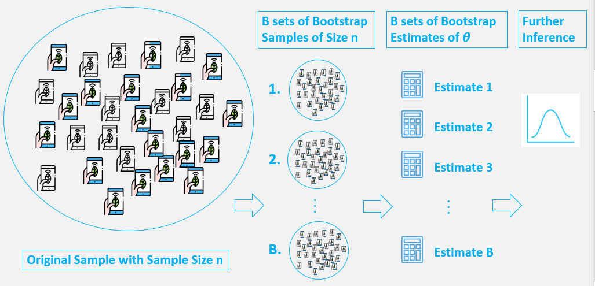

```{r setup, include=FALSE}
knitr::opts_chunk$set(echo = TRUE, comment = NA, fig.align = "center", warning = FALSE, message = FALSE)
library(dplyr)
library(ggplot2)
library(moderndive)
library(knitr)
library(cowplot)
library(skimr)
```


In this chapter we will create and interpret *confidence intervals made by using the Bootstrap*. Let's start with the idea of the Bootstrap.


# Introduction to the Bootstrap


Rather than repeatedly obtaining independent data sets from the population, we instead obtain distinct data sets by *repeatedly sampling observations from the original data set with replacement*. This process is known as the Bootstrap process.


This approach is illustrated in the following Figure on a simple data set;



Note: Bootstrap sample size is $n$, which is the size of the original sample as well. This is usually the case.

&nbsp;

> ***The Bootstrap Idea:*** The original sample approximates the population from which it was drawn. So resamples from this sample approximate what we would get if we took   many samples from the population. The bootstrap distribution of a statistic, based on many resamples, approximates the sampling distribution of the statistic, based on many samples.
      

---

**BOOTSTRAP FOR A SINGLE POPULATION:**

Given a sample of size $n$ from a population,

  1. Draw a resample of size $n$ with replacement from the sample. 

  2. Compute a statistic that describes the sample, such as the sample mean.

  3. Repeat this resampling process many times, say 10,000.
  
  4. Construct the bootstrap distribution of the statistic. Inspect its spread, bias, and shape.
  
---


```{example}
We will investigate samples taken from the CDC’s database of births. For the North Carolina data: `NCBirths2004`, we are interested in $\mu$, the true birth weight mean for all North Carolina babies born in 2004.
```


```{r}
library(resampledata)
library(ggplot2)

data(NCBirths2004)

set.seed(13)
head(NCBirths2004)

mean(NCBirths2004$Weight) # Investigate the sample mean of the Weight

# This is how the sample Weight is distributed

ggplot(data = data.frame(NCBirths2004), aes(x = Weight)) + 
  geom_histogram(fill = "gray", color = "black") + 
  geom_vline(xintercept  = mean(NCBirths2004$Weight), color = "blue") +
  labs(x = "X: Weight", title = "Weights for NC births") + 
  theme_bw() 


# Let's start bootstrapping now!

BirthWeightSample <- NCBirths2004$Weight # This is my original SAMPLE 
n <- length(BirthWeightSample) # This is the original sample size

B <- 10000  # The number of bootstrap samples
boot_Mean_Wt <- numeric(B) # A vector to store bootstrap menas from the bootstrap samples

for (i in 1:B){
  x <- sample(BirthWeightSample, size = n, replace = TRUE) # Here n is the size of your bootstrap sample
  boot_Mean_Wt[i] <- mean(x)
}

mean(boot_Mean_Wt) # This is the mean of the bootstrap means - so the center of the bootstrap distribution
sd(boot_Mean_Wt) # This is the standard error of the bootstrap distribution


# Now plot the bootstrap distribution

ggplot(data = data.frame(x = boot_Mean_Wt), aes(x = x)) + 
  geom_histogram(fill = "lightblue", color = "black") + 
  geom_vline(xintercept  = mean(boot_Mean_Wt), color = "red") +
  labs(x = substitute(paste(bar(X),"* (g)")), 
       title = "Bootstrap distribution of means for NC birth weights") + 
  theme_bw() 


```

> Note: We use * to denote the bootstrap estimates. For example, $\bar{X}^*_1$ would be the mean from the first bootstrap sample.

```{definition}

The **bias** of the bootstrap estimate is the mean of the bootstrap distribution, minus the estimate from the original data. 

$$Bias_{boot}[\hat{\theta}^*] = E[\hat{\theta}^*] - \hat{\theta},$$
  
bootstrap estimate is *unbiased* if the Bias is zero.

Here $\theta$ can be the mean for example.
```


```{example}
Find the **bias** of the bootstrap mean for the previous example. 
```

```{r}
# Your code here:

```

```{r include=FALSE}
Bias <- mean(boot_Mean_Wt) - mean(BirthWeightSample)
Bias
```


```{exercise}
Arsenic is a naturally occurring element in the groundwater of Bangladesh. However, much of this groundwater is used for drinking water by rural populations, so arsenic poisoning is a serious health issue. 

The data frame `Bangladesh` consists infomation about of 271 wells in Bangladesh. 

1. Load the `Bangladesh` data from the library `resampledata`.

2. Find the sample mean of the arsenic concentrations for these 271 wells.

3. Plot and comment about how the arsenic concentrations for these 271 wells are distributed.

4. Find the mean and the standard error of the bootstrap distribution of the mean arsenic concentrations.

5. Plot and comment about bootstrap distribution of the mean arsenic concentrations.

6. Find the **bias** of the bootstrap mean. 
```


```{r include=FALSE}
set.seed(8)

#1

data("Bangladesh")
head(Bangladesh)

#2 
mean(Bangladesh$Arsenic) # Investigate the sample mean of the Weight


#3

# This is how the sample Arsenic concentration is distributed

ggplot(data = data.frame(Bangladesh), aes(x = Arsenic)) + 
  geom_histogram(fill = "gray", color = "black") + 
  geom_vline(xintercept  = mean(Bangladesh$Arsenic), color = "blue") +
  labs(x = "X: Arsenic concentration", title = "Arsenic concentrations for 271 wells in Bangladesh") + 
  theme_bw() 

#4

# Let' start bootstrapping now!

ArsenicInWells <- Bangladesh$Arsenic # This is my original SAMPLE 
n <- length(ArsenicInWells) # This is the original sample size

B <- 10000  # The number of bootstrap samples
boot_Mean_Arsenic <- numeric(B) # A vector to store bootstrap menas from the bootstrap samples

for (i in 1:B){
  x <- sample(ArsenicInWells, size = n, replace = TRUE) # Here n is the size of your bootstrap sample
  boot_Mean_Arsenic[i] <- mean(x)
}

mean(boot_Mean_Arsenic) # This is the mean of the bootstrap means - so the center of the bootstrap distribution
sd(boot_Mean_Arsenic) # This is the standard error of the bootstrap distribution


#5

# Now plot the bootstrap distribution

ggplot(data = data.frame(x = boot_Mean_Arsenic), aes(x = x)) + 
  geom_histogram(fill = "lightblue", color = "black") + 
  geom_vline(xintercept  = mean(boot_Mean_Arsenic), color = "red") +
  labs(x = substitute(paste(bar(X),"* (ppb)")), 
       title = "Bootstrap distribution of means Arsenic concentration") + 
  theme_bw() 


#6

Bias <- mean(boot_Mean_Arsenic) - mean(ArsenicInWells)
Bias

```


# BOOTSTRAP PERCENTILE CONFIDENCE INTERVALS 


The sample mean $\bar{X}$ gives an estimate of the true mean $\mu$, but it probably does not hit it exactly. It would be nice to have a range of values for the true $\mu$ that we are 95% sure includes the true $\mu$.


In the North Carolina birth weights case study, the bootstrap distribution shows roughly how sample means vary for samples of size 1009. If most of the sample means are concentrated within a certain interval of the bootstrap distribution, it seems reasonable to assume that the true mean is most likely somewhere in that same interval.

Thus, we can construct what is called a `95% confidence interval` by using the `2.5` and `97.5` percentiles of the bootstrap distribution as endpoints. We would then say that `we are 95% confident that the true mean lies within this interval`. These type of confidence intervals are called the `bootstrap percentile confidence intervals`.

```{definition}
BOOTSTRAP PERCENTILE CONFIDANCE INTERVALS:

The interval between 2.5 and 97.5 percentiles of the bootstrap distribution of a statistic is a 95% bootstrap percentile confidence interval for the corresponding parameter.
```

```{example}
Find and interpret the 95% bootstrap percentile confidence interval for the mean weight of North Carolina babies.
```

```{r}
# We use the `quantile` command

quantile(boot_Mean_Wt, probs = c(0.025, 0.975))
```

```{r}
# Here is a picture

ggplot(data = data.frame(x = boot_Mean_Wt), aes(x = x)) + 
  geom_histogram(fill = "lightblue", color = "black") + 
  geom_vline(xintercept  = c(3417.420, 3478.906), color = "blue") +
  geom_text(aes(x=3417.420, label="Lower Confidance Limit\n", y=500), colour="blue", angle=90, text=element_text(size=11))+
  geom_text(aes(x=3478.906, label="\n Upper Confidance Limit", y=500), colour="blue", angle=90, text=element_text(size=11))+
  geom_vline(xintercept  = c(mean(boot_Mean_Wt)), color = "red") +
  labs(x = substitute(paste(bar(X),"* (g)")), 
       title = "Bootstrap distribution of means for NC birth weights With Confidance Limits") + 
  theme_bw() 

```


For the North Carolina birth weights, the interval marked by the 2.5 and 97.5 percentiles is (3417.42, 3478.91). Thus, we would state that we are 95% confident that the true mean weight of North Carolina babies born in 2004 is between 3417.42 and 3478.91 g. 


```{exercise}
Find and *interpret* the 95% bootstrap percentile confidence interval for the true mean arsenic level in the Bangladesh wells.
```

```{r}
# Your code here
```


```{exercise}
In addition to the arsenic concentration for 271 wells, the Bangladesh data set contains chlorine concentration.
```
  
  a. Run the `skim()` command on the `Chlorine` column and notice the missing values (NA values)
  
  b. Use the following code to remove the missing values (NA values).

```{r}
# Removing missing values

chlorine_no_na <- Bangladesh %>%
  filter(!is.na(Chlorine)) 

# skim(chlorine_no_na) # Run this to check if the missing values are gone from the Chlorine column

chlorine_concentration <- chlorine_no_na$Chlorine # This is the original sample now.
  
```

  c. Bootstrap the mean (Find and plot)
  
```{r include=FALSE}
set.seed(8)
chlorine_concentration <- chlorine_no_na$Chlorine # This is my original SAMPLE 
n <- length(chlorine_concentration) # This is the original sample size

B <- 10000  # The number of bootstrap samples
boot_Mean_chlorine <- numeric(B) # A vector to store bootstrap menas from the bootstrap samples

for (i in 1:B){
  x <- sample(chlorine_concentration, size = n, replace = TRUE) # Here n is the size of your bootstrap sample
  boot_Mean_chlorine[i] <- mean(x)
}

mean(boot_Mean_chlorine) # This is the mean of the bootstrap means - so the center of the bootstrap distribution
sd(boot_Mean_chlorine) # This is the standard error of the bootstrap distribution


quantile(boot_Mean_chlorine, probs = c(.025, 0.975))

```


  
  d. Find and *interpret* the 95% bootstrap percentile confidence interval for the true mean Chlorine level in the Bangladesh wells.
  
  
```{exercise}
In addition to the arsenic concentration for 271 wells, the Bangladesh data set contains chlorine concentration.
```
  
  a. Bootstrap the 25% trimmed mean (Find and plot)
```{r include=FALSE}
set.seed(8)
chlorine_concentration <- chlorine_no_na$Chlorine # This is my original SAMPLE 
n <- length(chlorine_concentration) # This is the original sample size

B <- 10000  # The number of bootstrap samples
boot_TrMean_chlorine <- numeric(B) # A vector to store bootstrap menas from the bootstrap samples

for (i in 1:B){
  x <- sample(chlorine_concentration, size = n, replace = TRUE) # Here n is the size of your bootstrap sample
  boot_TrMean_chlorine[i] <- mean(x, trim = 0.25)
}

mean(boot_TrMean_chlorine) # This is the mean of the bootstrap means - so the center of the bootstrap distribution
sd(boot_TrMean_chlorine) # This is the standard error of the bootstrap distribution


quantile(boot_TrMean_chlorine, probs = c(.025, 0.975))
```
  

  
  b. Compare your results with the usual mean in the previous exercise.
  

# TWO SAMPLE BOOTSTRAP

---

We now turn to the problem of comparing two samples. In general, bootstrapping should mimic how the data were obtained. So the data correspond to independent samples from two populations, we should draw to samples that way. Then we proceed to compute the same statistic comparing the samples as per the original data, for example, difference in means or ratio of proportions.

**BOOTSTRAP FOR COMPARING TWO POPULATIONS:**
 
 Given independent samples of sizes m and n from two populations, 
 
  1. Draw a resample of size m with replacement from the first sample in a separate resample of size n for the second sample. Compute a statistic that compares the two groups, such as the difference between the two sample means. 
  
  2. Repeat this resampling process many times say 10,000.
  
  3. Construct the bootstrap distribution of the statistic. Inspect its spread, bias, and shape.

---


```{example}
Do men take more physical risks in the presence of an attractive women? 
```

Two phychologists in Australia conducted an experiment to explore this question. Male skateboarders were randomly assigned to perfom tricks in presence of an attractive Female Experimenter or a Male Experimenter.

Use the dataframe `Skateboard` from the library `resampledata` to create a 95% bootstap confidence interval for the difference in `Testosterone` levels when there is a Female Experimenter or a Male Experimenter present.


Following steps might be helpful.

1) Filter out the sample with Female Experimenter and name it `Ori_Female_sample`

2) Filter out the sample with Male Experimenter and name it `Ori_Male_sample`

3) Find the sizzes of each sample. Call those `nf` and `nm`

4) Bootstrap the difference between the sample means for above two samples.

5) Find a 95% percentile interval (bootstrap CI) for the 

6) Be sure to know how to interpret the CI.

7) Answer the original research question.


```{r include=FALSE}
library(resampledata)
data("Skateboard")
head(Skateboard)


Female_sample <- Skateboard %>%
  filter(Experimenter == "Female") 

Ori_Female_sample <- Female_sample$Testosterone

Male_sample <- Skateboard %>%
  filter(Experimenter == "Male")

Ori_Male_sample <- Male_sample$Testosterone

nf <- length(Ori_Female_sample)
nm <- length(Ori_Male_sample)


B <- 10000
boot_Mean_Diff <- numeric(B)

for (i in 1:B)
{
  sampleF <- sample(Ori_Female_sample, size = nf, replace = TRUE)
  sampleM <- sample(Ori_Male_sample, size = nm, replace = TRUE)

  boot_Mean_Diff[i] <- mean(sampleF) - mean(sampleM) 
  
}

quantile(boot_Mean_Diff, probs = c(.025, 0.975))


```


<!--
## Wrong interpretaions from quiz 9

We are 95% confident that the mpg of the cars **in this data set** will fall between 18.08 and 22.16


95% of all mpg values will be between 18.08 and 22.16.
-->

## Match pairs (Two Dependent Samples)

In this case we have *Two Dependent Samples*. (In the previous example we had two independent samples)., but the process is a little different.

Here is an algorithm:

___

 Given dependent samples of size n,
 
  1. Get the difference between the two samples and create a single sample of the differences.
 
  2. Draw a resample of size $n$ with replacement from the sample. Compute the statistic of interest such as the mean.
  
  2. Repeat this resampling process many times say 10,000.
  
  3. Construct the bootstrap distribution of the statistic. Inspect its spread, bias, and shape.
  
___

Here is an example: 

We would like to compare the mean semi-final and final sores of 12 female divers competing in the FINA Would Championship in 2017. 

Use a bootstrap CI to determine whether the mean scores for divers differ between the final and semi-final rounds.


Note: No matter what test we are supposed to use, it is always good practice to do a EDA, at leat about the grops that we are interesetd in. 

```{r include=FALSE}
data("Diving2017")
head(Diving2017)

skim(Diving2017)
```


```{r include=FALSE}
set.seed(111)
data("Diving2017")
head(Diving2017)

Ori_Final_sample <- Diving2017$Final
Ori_Semi_Final_sample <- Diving2017$Semifinal

ori_diff_sample <- Ori_Final_sample - Ori_Semi_Final_sample # Make a single sample of the difference

n <- length(ori_diff_sample)

B <- 10000
boot_Mean_Diff <- numeric(B)

for (i in 1:B)
{
  samp <- sample(ori_diff_sample, size = n, replace = TRUE)

  boot_Mean_Diff[i] <- mean(samp) 
  
}

quantile(boot_Mean_Diff, probs = c(.025, 0.975))


# Here is a picture

ggplot(data = data.frame(x = boot_Mean_Diff), aes(x = x)) + 
  geom_histogram(fill = "lightblue", color = "black") + 
  geom_vline(xintercept  = c(-6.61250, 30.94583), color = "blue") +
  geom_text(aes(x=-6.61250, label="Lower Confidance Limit = -6.61250 \n", y=6000), colour="blue", angle=90, text=element_text(size=11))+
  geom_text(aes(x=30.94583, label="\n Upper Confidance Limit = 30.94583", y=6000), colour="blue", angle=90, text=element_text(size=11))+
  geom_vline(xintercept  = c(mean(boot_Mean_Diff)), color = "red") +
  labs(x = substitute(paste(bar(X),"*")), 
       title = "Bootstrap distribution of means of the differences, With Confidance Limits") + 
  theme_bw() 


```

Interpretation of the CI (Answer to the research question): 


```{example}

Use the `FlightDelays` data frame from the `resampledata` package. Compute the variance of the flight delay
times in May and June. 

Construct and interpret a 95% bootstrap percentile confidence interval for the ratio of the variances. 

```

```{r include=FALSE}
set.seed(111)
data("FlightDelays")

DelayMay <- FlightDelays %>%
  filter(Month == "May")

Ori_DelayMay <- DelayMay$Delay
nm <- length(Ori_DelayMay)


DelayJune <- FlightDelays %>%
  filter(Month == "June")

Ori_DelayJune <- DelayJune$Delay
nj <- length(Ori_DelayJune)


B <- 10^4
rv <- numeric(B)

for(i in 1:B){
  bsM <- sample(Ori_DelayMay, nm, replace = TRUE)
  bsJ <- sample(Ori_DelayJune, nj, replace = TRUE)
  
  rv[i] <- var(bsJ)/var(bsM)
}
(CI <- quantile(rv, probs = c(0.025, 0.975)))
```


We are 95% confident that the true ratio (June/May) of delay variances falls in the interval (0.97, 2.35).


```{example}

A company institutes an exercise break to see if it will improve job satisfaction. Job satisfaction scores for 10 randomly selected workers before and after the exercise program are shown in the table below. Use a bootstrap CI to check whether the job satisfaction has increased.
```


| Worker |	Before |	After
| -------|---------|------|
| 1 |	18 |	25
| 2	| 18 |	11
| 3	| 20 |	30
| 4	| 29 |	49
| 5	| 11 |	14
| 6	| 37 |	54
| 7	| 22  |	18
| 8	| 30 |	37
| 9	| 36 |	40
| 10 | 49	| 76


```{r include=FALSE}
set.seed(111)

Ori_Before_sample <- c(18, 18, 20, 29, 11, 37, 22, 30, 36, 49)
Ori_After_sample <- c(25, 11, 30, 49, 14, 54, 18, 37, 40, 76)

ori_diff_sample <- Ori_After_sample - Ori_Before_sample # Make a single sample of the difference

n <- length(ori_diff_sample)

B <- 10000
boot_Mean_Diff <- numeric(B)

for (i in 1:B)
{
  samp <- sample(ori_diff_sample, size = n, replace = TRUE)

  boot_Mean_Diff[i] <- mean(samp) 
  
}

quantile(boot_Mean_Diff, probs = c(.025, 0.975))
```


