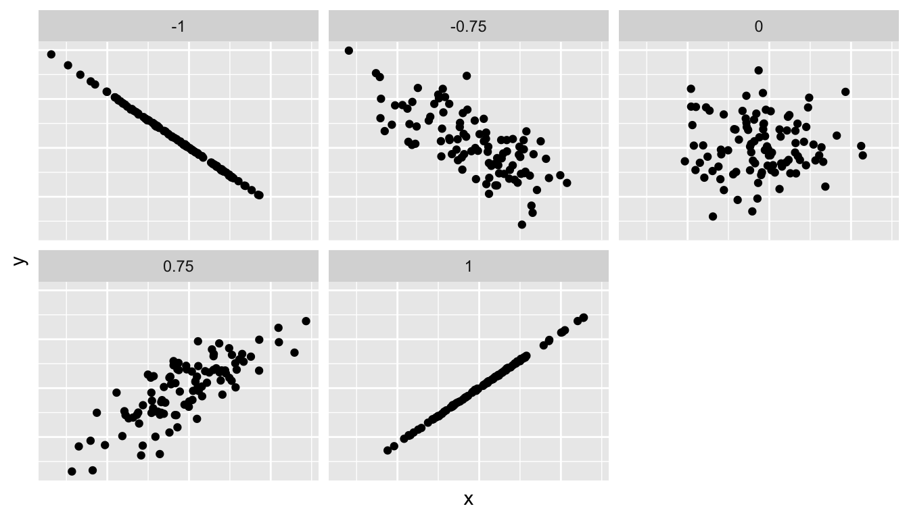

```{r setup, include=FALSE}
knitr::opts_chunk$set(echo = TRUE, warning = FALSE, message = FALSE, fig.align = "center", comment = NA, options(scipen=999))
library(tidyverse)
library(resampledata)
library(knitr)

library(ggplot2)
library(dplyr)
library(moderndive)
library(gapminder)
library(skimr)
```

# What is linear regression?

In regression we try to *predict* one variable based on one or more other variables.

  * The variable we want to predit is called the response variable,  denoted by $y$.
  * The variable(s) that we use to predict $y$ is(are) called the predictor(s) or explanatory variable(s),  denoted by $x$.


#  What do we cover?

* In this current chapter on basic regression, we’ll always have only one explanatory variable.
In *Section 2*, this explanatory variable will be a single numerical explanatory variable $x$. This scenario is known as simple linear regression.


* In *Section 3*, this explanatory variable will be a categorical explanatory variable $x$.


# One numerical explanatory variable

```{example}
Why do some professors and instructors at universities and colleges get high teaching evaluations from students while others don’t? What factors can explain these differences? 
  
Researchers at the University of Texas in Austin, Texas (UT Austin) tried to answer this question: what factors can explain differences in instructor’s teaching evaluation scores? To this end, they collected information on  $n = 463$ instructors. A full description of the study can be found at [openintro.org](openintro.org).


We’ll keep things simple for now and try to explain differences in instructor evaluation scores as a function of one numerical variable: their “`beauty score`.” 

  * Could it be that instructors with higher beauty scores also have higher teaching evaluations? 
  * Could it be instead that instructors with higher beauty scores tend to have lower teaching evaluations? 
  * Or could it be there is no relationship between beauty score and teaching evaluations?
  
  
We’ll address these questions by modeling the relationship between these two variables with a particular kind of linear regression called *simple linear regression*. Simple linear regression is the most basic form of linear regression. With it we have

  1. A numerical outcome variable $y$. In this case, their `teaching score`.
  2. A single numerical explanatory variable $x$. In this case, their `beauty score`.

```

## Exploratory data analysis

A **crucial** step before doing any kind of modeling or analysis is performing an exploratory data analysis, or EDA, of all our data.

  1. Just looking at the raw values, in a spreadsheet for example. 
  2. Computing summary statistics likes means, medians, and standard deviations.
  3. Creating data visualizations.
  
  
Okay... Let's begin. The dataframe that we are working on is `evals` and it is in the `moderndive` library.

### Looking at the raw values

Type `library(moderndive)` in the console and hit return, then type `View(evals)` in the console and hit return. Also type `?evals` in the console to see the description of the dataframe.
  
### Computing summary statistics

Since we are only interested in one $x$ variable, namely, `bty_avg`, let's select only the $y$ variable, `score` and `bty_avg`.
  
  
```{r}
evals_onex <- evals %>%
  select(score, bty_avg)

# View(evals_onex) # Only In the console, DO NOT run the View command here

glimpse(evals_onex)

```
  
Since both the outcome variable score and the explanatory variable bty_avg are numerical, we can compute summary statistics about them such as the mean, median, and standard deviation. 

Let’s  pipe this into the `skim()` function from the `skimr` package. This function quickly return the following summary information about each variable.

```{r}
evals %>% 
  select(score, bty_avg) %>% 
  skim()

#Or, since we have already selected the variables, skim(evals_onex) would also works
```

Here, `p0` for example the 0th percentile: the value at which 0% of observations are smaller than it. This is also known as the minimum. 

According to the histograms: variable `score` is skewed to the ________________, and the variable `bty_avg` is skewed to the ________________.

We get an idea of how the values in both variables are distributed. For example, the mean teaching score was _______ out of 5 whereas the mean beauty score was _______ out of 10. Furthermore, the middle 50% of teaching scores were between _______ and _______ () while the middle 50% of beauty scores were between _______ and _______ out of 10.


#### Correlation Coefficient

Since we are considering the relationship between two numerical variables, it would be nice to have a summary statistic that simultaneously considers both variables. The correlation coefficient is a bivariate summary statistic that fits this bill.

A correlation coefficient is a quantitative expression between -1 and 1 that summarizes the strength of the linear relationship between two numerical variables:

  * -1 indicates a perfect negative relationship: as the value of one variable goes up, the value of the other variable tends to go down.
  * 0 indicates no relationship: the values of both variables go up/down independently of each other.
  * +1 indicates a perfect positive relationship: as the value of one variable goes up, the value of the other variable tends to go up as well.


Following figure gives examples of different correlation coefficient values for hypothetical numerical variables $x$ and  $y$. 

We see that while for a correlation coefficient of -0.75 there is still a negative relationship between $x$ and $y$, it is not as strong as the negative relationship between $x$ and $y$ when the correlation coefficient is -1.

  

The correlation coefficient is computed using the `get_correlation()` function in the `moderndive` package. Here is the syntax:

```{}
your_dataframe %>% 
  get_correlation(formula = response_variable ~ explanatory_variable)
```

```{r}

evals_onex %>% 
  get_correlation(formula = score ~ bty_avg)

```

Another way yo get the correlations is:

```{r}
cor(x = evals_onex$bty_avg, y = evals_onex$score)
```


In our case, the correlation coefficient of 0.187 indicates that the relationship between teaching evaluation score and beauty average is “weakly positive.” 


### Let’s now proceed by visualizing this data. 

Since both the `score` and `bty_avg` variables are numerical, a _________ is an appropriate graph to visualize this data. 

```{r}
# Write the code to produce the following graph

```


```{r echo=FALSE}
ggplot(evals_onex, aes(x = bty_avg, y = score)) +
  geom_point() + 
  labs(x = "Beauty Score", y = "Teaching Score", 
       title = "Relationship of teaching and beauty scores")
```

  > Note: Our dataset suffers from *overplotting.* Remedy that using  `geom_jitter()`

```{r eval=FALSE}
ggplot(evals_onex, aes(x = bty_avg, y = score)) +
  geom_jitter()
  labs(x = "Beauty Score", y = "Teaching Score", 
       title = "Relationship of teaching and beauty scores")
```


Going forward for simplicity’s sake however, we’ll only use the regular scatterplot.

#### Adding a “regression line” to the scatterplot.

A regression line is a “best fitting” line in that of all possible lines you could draw on this plot, it is “best” in terms of some mathematical criteria. We discuss this later.


```{r}
ggplot(evals_onex, aes(x = bty_avg, y = score)) +
  geom_point() +
  labs(x = "Beauty Score", y = "Teaching Score", 
       title = "Relationship of teaching and beauty scores") +  
  geom_smooth(method = "lm")
```


What are the grey bands surrounding the blue line? These are *standard error bands*, in other words *error/uncertainty bands*. Let’s skip this idea for now and suppress these grey bars for now by adding the argument `se = FALSE` to `geom_smooth(method = "lm")`.

```{r}
ggplot(evals_onex, aes(x = bty_avg, y = score)) +
  geom_point() +
  labs(x = "Beauty Score", y = "Teaching Score", 
       title = "Relationship of teaching and beauty scores") +
  geom_smooth(method = "lm", se = FALSE)
```


> Question: 

Conduct a new exploratory data analysis with the same outcome variable $y$ being `score` but with `age` as the new explanatory variable $x$. Remember, this involves three things:

  1. Looking at the raw values.
  2. Computing summary statistics of the variables of interest.
  3. Creating informative visualizations.

What can you say about the relationship between `age` and teaching `score`s based on this exploration?


## Simple linear regression

The equation of the regression line is  $\hat{y} = b_0+b_1\cdot x$ where 

  * the intercept coefficient is  $b_0$ is the value of $\hat{y}$ when $x=0$, and
  * the slope coefficient $b_1$ is the increase in $\hat{y}$ for every one unit increase in $x$.
  
### How to obtain  $b_0$ and $b_1$ values.

Consider the following regression line:


The vertical distances from the points to the line are called the residuals. We obtain the line by minimizing the sum of the squares of the distances from the points to the line. If we denote the observed points by $y_i$ and the opints on the line by $\hat{y_i}$. Then the reiduals can be denoted by $y_i-\hat{y_i}$. So we obtain the line ($b_0$ and $b_1$), by minimizing the following quantity
$$\texttt{Residual sum of squares} = \sum(y_i-\hat{y_i})^2$$ 
  
### How to use R to get $b_0$ and $b_1$ values.

The lm() function that “fits” the linear regression model is typically used as `lm(y ~ x, data = data_frame_name)` where:

  * `y` is the outcome variable, followed by a tilde `(~)`. In our case, `y` is set to `score`.
  * `x` is the explanatory variable. In our case, `x` is set to `bty_avg`. We call the combination `y ~ x` a model formula.
  * `data_frame_name` is the name of the data frame that contains the variables `y` and `x`. In our case, `data_frame_name` is the `evals_onex` data frame.

```{r}
score_model <- lm(score ~ bty_avg, data = evals_onex)
score_model
```

This output is telling us that the Intercept coefficient $b_0$ of the regression line is 3.8803 and the slope coefficient ($b_1$) for `bty_avg` is 0.0666. Therefore the blue regression line is (line in the previous figure)

$$\hat{\text{score}} = b_0 + b_1 \cdot \text{bty_avg}$$ 
$$\hat{\text{score}} = 3.8803 + 0.0666 \cdot \text{bty_avg}$$


Interpretations of $b_0$ and $b_1$:
  
  * The intercept coefficient $b_0 = 3.8803$: 
  
    For instructors who with beauty score of 0, we would expect to have on average a teaching score of 3.8803.
    In this case interpretaion of $b_0$ is meaningless. (Why?)
    
```{r}
Range <- range(evals_onex$bty_avg)
Range
```

   
    
  * The intercept coefficient $b_1 = + 0.0666$: 
  
    This is a numerical quantity that summarizes the relationship between the outcome and explanatory variables.     Note that the sign is positive, suggesting a positive relationship between beauty scores and teaching scores,     meaning as beauty scores go up, so also do teaching scores go up. The slope’s precise interpretation is:

  > For every increase of 1 unit in `bty_avg`, there is an associated increase of, on average, 0.0666 units of `score`.

> Question:

  a) Fit a new simple linear regression for `score` where `age` is the new explanatory variable $x$.
  
  b) Interpret the regression coefficients.
  

## Observed, fitted values and residuals

* Observed values: Usually the $y$ values from the dataset

* Fitted values: $\hat{y}$ values we get from the model($\hat{y} = b_0+b_1\cdot x$)

* Residuals: Difference between Observed and Fitted values = $y - \hat{y}$

Let's only consider one observation: For example, say we are interested in the 21st instructor in this dataset:

```{r}
kable(evals_onex[21,])
```


Here in this example;

* Observed value = $y$ = ______

* Fitted value = $\hat{y}$ = ______

* Residual = $y - \hat{y}$ = ______

Now, when we have to find residuals for all the values (not just one). `R` can do ir for us...

```{r}
regression_points <- get_regression_points(score_model)

regression_points
```


### Diagnostics (Residual Plot)

The plot of residuals against the fitted values ($\hat{y}$, $y_i-\hat{y_i}$) provides infomation on the appropriateness of a *straight-line model*. Ideally, points should be scattered randomly about the reference line $y=0$ See the following Figure. 


Residual plots are useful for the followings:

  * Revealing curvature -- that is, for indicating that the relationship between the two variables is not linear.
  
  * Spoting outliers.
  

```{example}
Create a residul plot for the `score_model` and interpret the residial plot.
```


```{r}
ggplot(score_model, aes(x = .fitted, y = .resid)) + geom_point()
```


Plotted points are scattered randomly (no pattern) about the reference line $residual = 0$. Also, no outliers are detected. Therefore the residual plot indicate that the relationship between `bty_avg` and `score` is linear.


```{example}
Create a residul plot for the model where $y = score$ and $x=age$ and interpret the residial plot.
```


## One categorical explanatory variable

When the explanatory variable $x$ is categorical, the concept of a “best-fitting” line is a little different than the one we saw in the previous Section where the explanatory variable $x$ was numerical.

We use the following example to study this.

It’s an unfortunate truth that life expectancy is not the same across various countries in the world; there are a multitude of factors that are associated with how long people live. International development agencies are very interested in studying these differences in the hope of understanding where governments should allocate resources to address this problem. In this section, we’ll explore differences in life expectancy in two ways:

  1. Differences between continents: Are there significant differences in life expectancy, on average, between the five continents of the world: Africa, the Americas, Asia, Europe, and Oceania?
  
  2. Differences within continents: How does life expectancy vary within the world’s five continents? For example, is the spread of life expectancy among the countries of Africa larger than the spread of life expectancy among the countries of Asia?

To answer such questions, we’ll study the `gapminder` dataset in the `gapminder` package. This dataset has international development statistics such as life expectancy, GDP per capita, and population by country ( n = 142) for 5-year intervals between 1952 and 2007.


We’ll use this data for linear regression again, but note that our explanatory variable  $x$ is now **categorical**, and not numerical like when we covered simple linear regression in Section 6.1. More precisely, we have:

  1. A numerical outcome variable $y$. In this case, life expectancy.

  2. A single categorical explanatory variable $x$, In this case, the continent the country is part of.
  
As always, the first step in model building is...

### Exploratory data analysis

  1. Type `View(gapminder)` in the console.

Let’s load the gapminder data and `filter()` for only observations in 2007. Next we `select()` only the variables we’ll need along with `gdpPercap`, which is each country’s gross domestic product per capita (GDP). GDP is a rough measure of that country’s economic performance. Lastly, we save this in a data frame with name gapminder2007:

```{r}
library(gapminder)
gapminder2007 <- gapminder %>%
  filter(year == 2007) %>% 
  select(country, continent, lifeExp, gdpPercap)

#Use View(gapminder2007) if you would like to see the subset
```

  2. Let's look at the summaries.
  
```{r}
glimpse(gapminder2007)
```
  
Notice that variable `continent` is indeed categorical.

Let’s apply the `skim()` function from the `skimr` package to our two variables of interest: `continent` and `lifeExp`:

```{r}
# You try

```


```{r}
gapminder2007 %>% 
  select(continent, lifeExp) %>% 
  skim()

```


Given that the global median life expectancy is _____, half of the world’s countries (____ countries) will have a life expectancy less than ____. Further, half will have a life expectancy greater than this value. The mean life expectancy of ____ is lower however. Why are these two values different? Let’s look at a histogram of lifeExp to see why.

```{r}
# Write the code to produce the histogram 

```

```{r echo=FALSE}
ggplot(data = gapminder2007, aes(x=lifeExp)) + geom_histogram(binwidth =  5, color="white", fill = "orchid4")
```


We see that this data is skewed to the _____: there are a few countries with very low life expectancy that are bringing down the _____ (mean/ median) life expectancy. However, the  _____ (mean/ median) is less sensitive to the effects of such outliers. Hence the  _____ (mean/ median) is greater than the  _____ (mean/ median) in this case. 


Let’s proceed by comparing median and mean life expectancy **between continents** by using `group_by(continent)`:

```{r}
# Write the code to produce the histogram 

```


```{r echo=FALSE}
lifeExp_by_continent <- gapminder2007 %>%
  group_by(continent) %>%
  summarize(median = median(lifeExp), mean = mean(lifeExp), N = n())

kable(lifeExp_by_continent)

```


We see now that there are differences in life expectancy between the continents. For example let’s focus on only medians. While the median life expectancy across all $n = 142$ countries in 2007 was 71.935, the median life expectancy across the $n$ = ___ countries in Africa was only ____.


Let’s create a corresponding visualization. 

  1. One way to compare the life expectancy of countries in different continents would be via a faceted histogram.
```{r}
# Write the code to produce the facet histogram 

```

```{r echo=FALSE}
ggplot(gapminder2007, aes(x = lifeExp, fill=continent)) +
  geom_histogram(binwidth = 5, color = "white") +
  labs(x = "Life expectancy", y = "Number of countries", 
       title = "Life expectancy by continent") +
  facet_wrap(~ continent, nrow = 2)
```

  2. Another way would be via a geom_boxplot where we map the categorical variable continent to the $x$ -axis and the different life expectancy within each continent on the $y$-axis

```{r}
# Write the code to produce the side-by-side boxplots 

```

```{r}
ggplot(gapminder2007, aes(x = continent, y = lifeExp, fill = continent)) +
  geom_boxplot() +
  labs(x = "Continent", y = "Life expectancy (years)", 
       title = "Life expectancy by continent") 
```


 * For example, half of all countries in Asia have a life expectancy below ____ years whereas half of all countries in Asia have a life expectancy above ____ years. (This is because the Median life expectancy for the countries in Asia is ___). 
 
 * Furthermore, note that: Africa and Asia have much more spread/variation in life expectancy as indicated by the _________ (the height of the boxes).
 
 * Oceania has almost no spread/variation, but this might in large part be due to the fact there are only two countries in Oceania: Australia and New Zealand.

Now, let’s start making comparisons of life expectancy between continents.

First we have to pick a *baseline* to compare with. Let's use Africa.

 * We can see that even the country with the highest life expectancy in Africa is still lower than all countries in ________.
 
 * We can see that even the country with the highest life expectancy in Africa is still lower than the median life expectancy of the countries in ________.

 * The median life expectancy of the Americas is roughly 20 years greater.
 * The median life expectancy of Asia is roughly 20 years greater.
 * The median life expectancy of Europe is roughly 25 years greater.
 * The median life expectancy of Oceania is roughly 27.8 years greater.


### Linear regression

In section 6.1 we introduced *simple linear* regression, which involves modeling the relationship between a numerical outcome variable $y$ as a function of a numerical explanatory variable $x$, in our life expectancy example, we now have a *categorical explanatory variable*  $x$ continent. 

While we still can fit a regression model, given our categorical explanatory variable we no longer have a concept of a “*best-fitting*” line, but rather “*differences relative to a baseline for comparison*.”

Before we fit our regression model, let’s create a table similar to the previous Table, but

  1. Report the mean life expectancy for each continent.
  
  2. Report the difference in mean life expectancy relative to Africa’s mean life expectancy of 54.806 in the column “mean vs Africa”; this column is simply the “mean” column minus 54.806.


```{r}
#Create the following table. Using instructions above...

```

```{r echo=FALSE}
mean_lifeExp_by_continent <- gapminder2007 %>%
  group_by(continent) %>%
  summarize(mean = round(mean(lifeExp), 3), "mean vs Africa" = round(mean(lifeExp),3)-54.806)

kable(mean_lifeExp_by_continent)
```

Now, let’s use the `lm` function we introduced in Section 6.1 to get the regression coefficients for gapminder2007 analysis:

```{r}
lifeExp_model <- lm(lifeExp ~ continent, data = gapminder2007)
lifeExp_model

summary(lifeExp_model)
```


What are these values? First, we must describe the equation for fitted value $\hat{y}$, which is a little more complicated when the $x$ explanatory variable is categorical:

$$\hat{\text{life exp}} = b_0 + b_{Amer} \cdot 1_{Amer}(x) + b_{Asia} \cdot 1_{Asia}(x) + b_{Euro} \cdot 1_{Euro}(x) + b_{Ocean} \cdot 1_{Ocean}(x) $$
$$\hat{\text{life exp}} = 54.81 + 18.80 \cdot 1_{Amer}(x) + 15.92 \cdot 1_{Asia}(x) +  22.84 \cdot 1_{Euro}(x) + 25.91 \cdot 1_{Ocean}(x) $$


What does $1_{A}(x)$ menas? (from your previous math course) 

In mathematics this is known as an “indicator function” that takes one of two possible values:

\[ 
1_{A}(x) = 
\begin{cases} 
      1 & x \in A \\
      0 & x \notin A 
   \end{cases}
\]


In a statistical modeling context this is also known as a “dummy variable”. In our case, let’s consider the first such indicator variable:

\[ 
1_{Amer}(x) = 
\begin{cases} 
      1 &  \text{if country x is in the Americas} \\
      0 & \text{otherwise}
   \end{cases}
\]


Now let’s interpret the regression coefficients.

  1. First $b_0 = intercept = 54.8$ --- the mean life expectancy for countries in Africa, because Africa was our baseline.
  
  2. $b_{Amer} = continentAmericas = 18.8$ is the difference in mean life expectancy of countries in the Americas relative to Africa, or in other words, on average countries in the Americas had life expectancy 18.8 years greater. 
  
  The fitted value yielded by this equation is: (i.e. in this case, only the indicator function $1_{Amer}(x)$ is equal to 1, but all others are 0.)
  
  $$\hat{\text{life exp}} = 54.81 + 18.80 \cdot 1_{Amer}(x) + 15.92 \cdot 1_{Asia}(x) +  22.84 \cdot 1_{Euro}(x) + 25.91 \cdot 1_{Ocean}(x) $$
  
  $$\hat{\text{life exp}} = 54.81 + 18.80 \cdot 1 + 15.92 \cdot 0 +  22.84 \cdot 0 + 25.91 \cdot 0 $$
  $$\hat{\text{life exp}} = 54.81 + 18.80 $$
  $$\hat{\text{life exp}} = 72.9$$
  Furthermore, this value corresponds to the group mean life expectancy for all American countries.

  3. Similarly, $b_{Asia} = continentAsia = 15.9$ ---Interpret this...
  
  Rest of the coefficients can be interpreted the same way.


Let’s generalize this whole thing a bit. 

  * If we fit a linear regression model using a categorical explanatory variable $x$ that has $k$ levels, a regression model will return an intercept and $k −1$ “slope” coefficients. 
  
  * When $x$ is a numerical explanatory variable the interpretation is of a “slope” coefficient, 
  
  * but when $x$ is categorical the meaning is a little trickier. They are "offsets" relative to the baseline.

  
```{example}
Fit a new linear regression to predcit the GDP using continent. Write the model. Interpret the coefficients. (Use the `gapminder2007` dataftame that we created)
```

```{r}
data("FlightDelays")
str(FlightDelays)

ggplot(FlightDelays, aes(x= Delayed30, y = FlightLength)) + geom_boxplot()

data("MobileAds")

variable.names(MobileAds)

diff <- MobileAds$m.cpc_post-MobileAds$m.cpc_pre

hist(diff)
```


