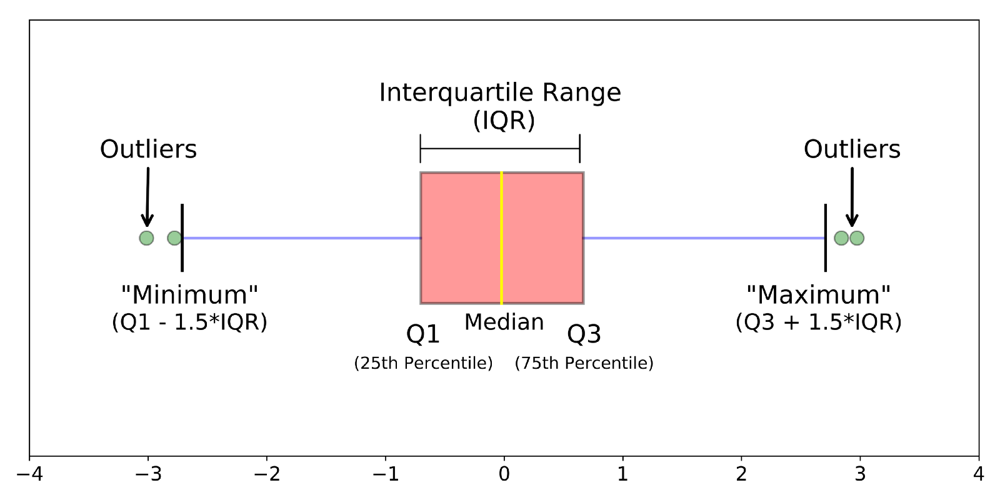

# Basic Plots

We have already discussed the basic graphs last week!


# Numerical Summaries

## Center

**Mean** 

If $x_1, x_2,...,x_n$ are $n$ data values then the mean is:

$$\bar{x} = \dfrac{1}{n}\sum_{i=1}^n x_i$$

Example: Find the mean of 2, 15, 3, 8, 12, 5.

```{r}
data <- c(2, 15, 3, 8, 12, 5)

mean(data)
```

**Median**

Median is the middle value of a sorted data set. Usually works well with outliers and when the distribution is skewed.

Example: Find the median of 2, 15, 3, 8, 12, 5.

```{r}
data <- c(2, 15, 3, 8, 12, 5)

median(data)
```


**Trimmed Mean** (25% Trimmed Mean)

Here for example you sort the data, omit 25% of the observations on each end, and then take the mean of the remaining middle 50% of the observations. Usually works well with outliers.

Example: Find the 25% Trimmed Mean of 2, 15, 3, 8, 12, 5.

```{r}
data <- c(2, 15, 3, 8, 12, 5)

mean(data, trim = 0.25)
```


## Spread

Following are the common measures of the spread;

**Range** 

Range is the difference between the largest and the smallest values. Range is sensitive to outliers.

**IQR**

Range is the difference between the third and the first quartiles (75th and the 25th percentiles). IQR is NOT sensitive to outliers.


**Standard deviation**

If $x_1, x_2,...,x_n$ are $n$ data values then the Standard deviation is:

$$s = \sqrt{\dfrac{1}{n-1}\sum_{i=1}^n (x_i - \bar{x})^2}$$


Example: Find the Range, IQR and the Standard deviation  of 2, 15, 3, 8, 12, 5.

```{r}

data <- c(2, 15, 3, 8, 12, 5)

range(data)

IQR(data)

sd(data)

```


## Shape

### Five number summary

In this class we use the `five number summary` to describe the shape of a data set.


`five number summary`: The minimum, first quartile, median, third quartile, and the maximum.


Example: Conside the 15 numbers 9,10,11,11,12,14,16,17,19,21,25,31,32,41,61. Find the five number summary.

```{r}
fiveNum <- c(9,10,11,11,12,14,16,17,19,21,25,31,32,41,61)

summary(fiveNum)
```

### Boxplots

A boxplot is a type of graph that can be used to visualize the five-number summary.

Create a boxplot for the following 21 data values. 


5, 6, 6, 8, 9, 11, 11, 14, 17, 17, 19, 20, 21, 21, 22, 23, 24, 32, 40, 43, 49.

```{r}
library(ggplot2)

boxplotdata <- c(5, 6, 6, 8, 9, 11, 11, 14, 17, 17, 19, 20, 21, 21, 22, 23, 24, 32, 40, 43, 49)

boxplotdata <- data.frame(boxplotdata)

ggplot(data = boxplotdata, mapping = aes(y = boxplotdata)) +
  geom_boxplot()

```

**Notes about a boxplot: **

  


Example: Exercise  2.4
 
Import the `flight delays` case study in Section 1.1.

```{r}
library(resampledata) # dataset for MSWR book is in this library
library(ggplot2)
library(dplyr)
data(FlightDelays)
```


a) *Create a table and a bar chart of the departure times (`DepartTime`)*


```{r}
head(FlightDelays)
glimpse(FlightDelays)

table(FlightDelays$DepartTime)

ggplot(data = FlightDelays, mapping = aes(x = DepartTime)) +
  geom_bar()

```

b) *Create a contingency table of the variables `Day` and `Delayed30`. For each day, what is the proportion of flights delayed at least 30 min.*

```{r}
table(FlightDelays$Day, FlightDelays$Delayed30)

```


Here we use Ch 5: Data Wrangling via dplyr, of MD.


Note: 

The `%>%` operator allows us to go from one step in `dplyr` to the next easily so we can, for example:

  * filter our data frame to only focus on a few rows then
  * group_by another variable to create groups then
  * summarize this grouped data to calculate the mean (for example) for each level of the group.

```{r}
day_delayed30 <- FlightDelays %>% 
  group_by(Day) %>% 
  summarize(proportion= sum(Delayed30=="Yes")/sum(Delayed30=="Yes"|Delayed30=="No"))

day_delayed30
```


c) *Create side by side boxplots of the lenghts of the flights, grouped by whether or not the flight was delayed at least 30 min.*

```{r}

ggplot(data = FlightDelays, mapping = aes(x = factor(Delayed30), y = FlightLength)) +
  geom_boxplot() +
    labs(x = "Delayed at least 30 min?", y ="Flight Length")


```


d) *Do you think that there is a relationship between the lenght of a flight and whether or not the depature is delayed by at least 30 min?*


Excercise 2.5:


```{r}
data("GSS2002")
str(GSS2002)
```

a) 

```{r}
table(GSS2002$DeathPenalty)

ggplot(data = GSS2002, mapping = aes(x = DeathPenalty)) +
  geom_bar(fill = "orchid3")
```


b) 

```{r}
table(GSS2002$OwnGun)

summary(GSS2002$OwnGun)
```

c) 

```{r}
table(GSS2002$OwnGun, GSS2002$DeathPenalty)

death_gun <- GSS2002 %>% 
  group_by(OwnGun) %>% 
  summarize(proportion_favor_death = sum(DeathPenalty=="Favor", na.rm = TRUE)/sum(DeathPenalty=="Favor"|DeathPenalty=="Oppose", na.rm = TRUE))

death_gun
```

